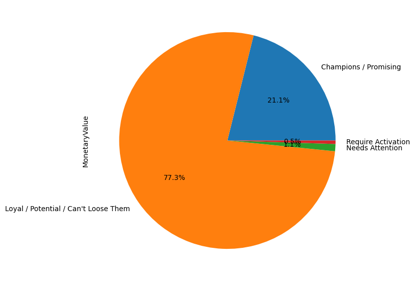
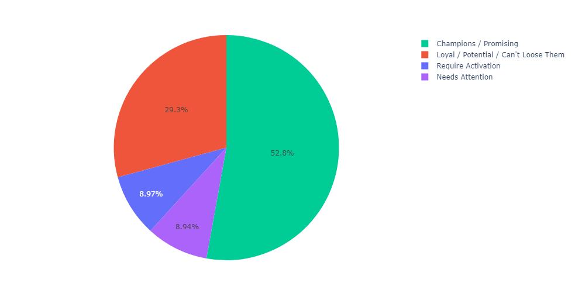

# Performing Customer Segmentation using RFM Technique
"To find a Loyal Customers"
# Customer Segmentation using RFM Technique

## Overview

This project aims to understand and categorize customer behavior by utilizing the RFM (Recency, Frequency, Monetary Value) model. RFM is a straightforward marketing analysis tool that classifies customers based on how recently they made a purchase, how often they make purchases, and how much money they spend.

## Objective

The primary goal is to identify distinct customer groups for better customer retention and targeted campaign strategies.

## Dataset Information

- **Size:** 541,909 rows; 8 columns
- **Customer ID Issues:** 135,080 transactions lack a customer ID
- **Timeframe:** Transactions recorded from 2010-12-01 08:26:00 to 2011-12-09 12:50:00

## Data Preprocessing

1. **Date Format:** Convert the date column to "yyyy-mm-dd" format.
2. **Unique Customers:** Identify and analyze data for 4,373 unique customers.
3. **Handling Missing Values:** Drop rows with missing customer IDs.

## Model Building using RFM

1. **TotalSum Calculation:** Group data by customer ID and create a TotalSum column for the online dataset.
2. **Snapshot Date:** Establish a benchmark date (2011-12-10).
3. **Customer Grouping:** Group data by customer ID.
4. **RFM Values Calculation:** Determine Recency, Frequency, and Monetary values for each customer.
5. **Customer Clustering:** Cluster customers into several unique groups.

## Interpretation

### Pareto Principle (80/20 Rule)

- **Observation:** 29% of customers contribute to 77% of business.
  
- **Recommendations:**
  - Develop a loyalty program for high-value customers.
  - Offer exclusive deals, discounts, and rewards to retain them.
  - Implement upselling and cross-selling strategies.
  - Request referrals from high-value customers and reward them.

### Low RFM Value Customers

- **Identification:** 8.94% of customers contribute only 0.5% to the business.

- **Strategies:**
  - Understand the needs and preferences of these customers.
  - Tailor products, services, and marketing efforts to meet their specific needs.
  - Focus on improving their customer experience.

## Conclusion

By leveraging the insights gained through RFM analysis, this project provides actionable strategies for customer retention and targeted marketing efforts. Understanding customer segments enables the implementation of effective business strategies to maximize customer satisfaction and overall success.

